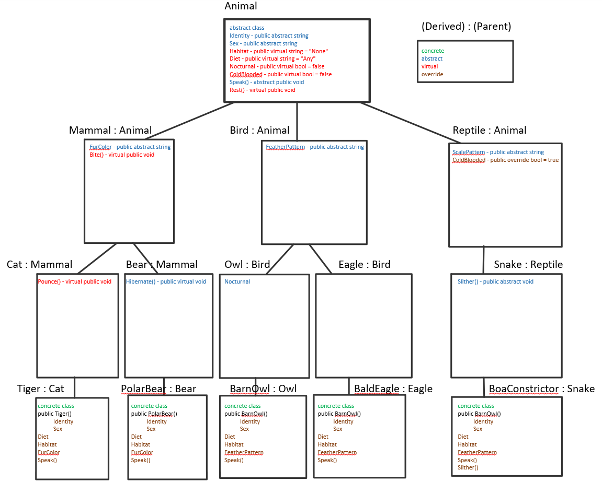

# Lab06-07-Zoo

## Introduction
- This project is a learning exercise, exploring Object-Oriented Programming and the concepts thereof. Through the process of building a zoo, we implement the four pillars of OOP: Inheritance, Abstraction, Polymorphism, and Encapsulation.

The four OOP principles can be explained as follows:
	Inheritance: The ability for one class to pass behaviors and properties to another.
	Abstraction: The ability to create a template or blueprint with basic information without instantiation.
	Polymorphism: The ability to change the behaviors and values of selected methods/properties.
	Encapsulation: The ability to group specific info for reusability or access requirements.

We use each of the four principles in the following ways:
	Inheritance: we have a base class of Animal from which all our other classes inherit properties such as having a habitat and diet
	Abstraction: all of our classes are abstract until the lowest level, so that we can pass down the fact that all animals must have a diet property even though we don't know each animal's individual diet.
	Polymorphism: lower classes override many of the properties defined in the classes higher up.
	Encapsulation: we have multiple branches that all stem from the animal class, thus keeping all the animals under this umbrella of categorization without having to rewrite all our properties.